# 🔐 AWS VPC - AWS Bastion Host & NAT Gateway Project

## 📘 Project Overview

This project demonstrates a secure VPC setup in AWS using both a Bastion Host (for SSH into private instances) and a NAT Gateway (for outbound internet access from private subnets). It includes both public and private subnets, routing configurations, and access mechanisms.

---

## 🛠️ AWS Services Used

- **Amazon VPC**
- **Subnets (Public & Private)**
- **Route Tables**
- **Internet Gateway (IGW)**
- **NAT Gateway**
- **EC2 Instances (Bastion and Private)**
- **Key Pair for SSH**

---

## 🧪 Step-by-Step Implementation

### 1️⃣ Create Public Subnet

A public subnet was created for the Bastion Host.

📷 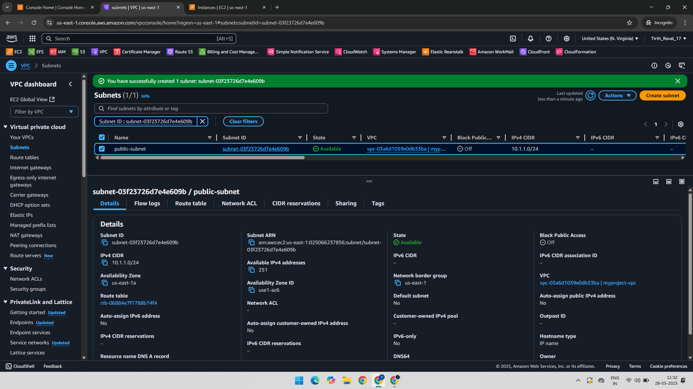

---

### 2️⃣ Configure Route Table for Public Subnet

The public subnet’s route table includes a route to the Internet Gateway (`0.0.0.0/0` → IGW).

📷 

---

### 3️⃣ Associate Public Subnet with Route Table

📷 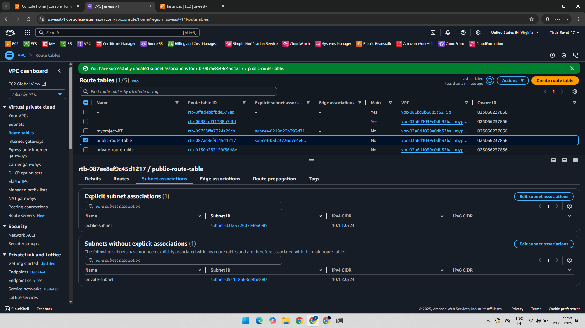

---

### 4️⃣ Create Private Subnet

📷 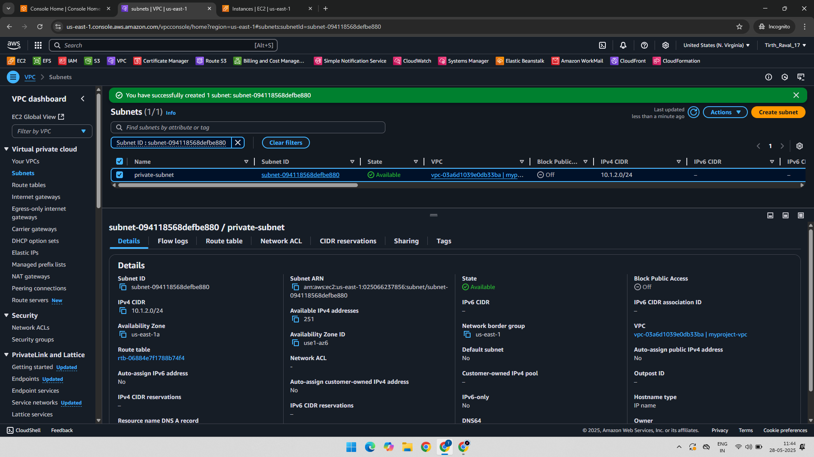

---

### 5️⃣ Configure Route Table for Private Subnet (Initially No IGW)

📷 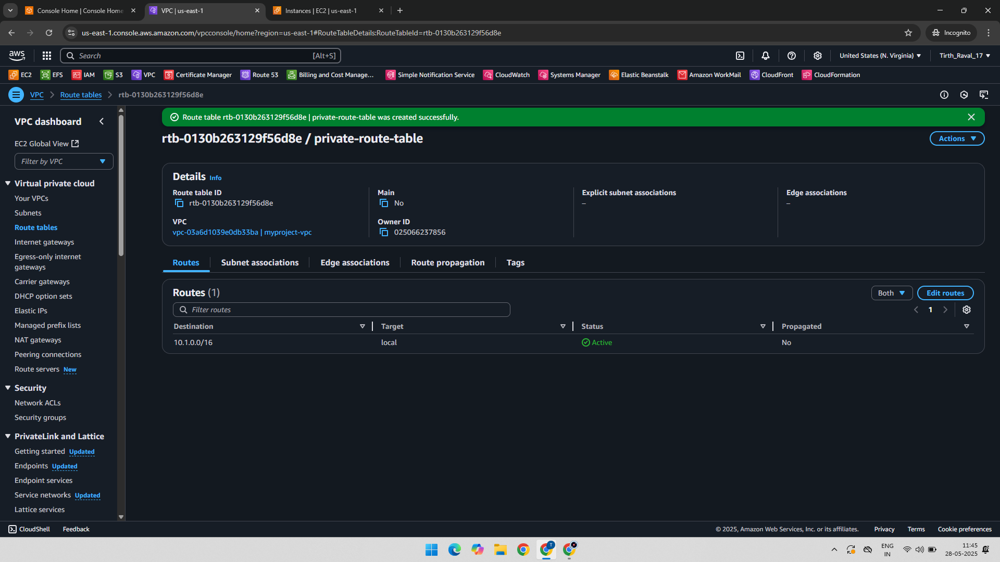

---

### 6️⃣ Associate Private Subnet with Its Route Table

📷 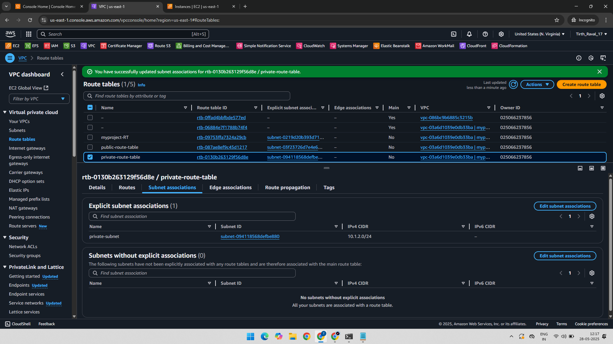

---

### 7️⃣ Launch Instance in Public Subnet (Bastion Host)

📷 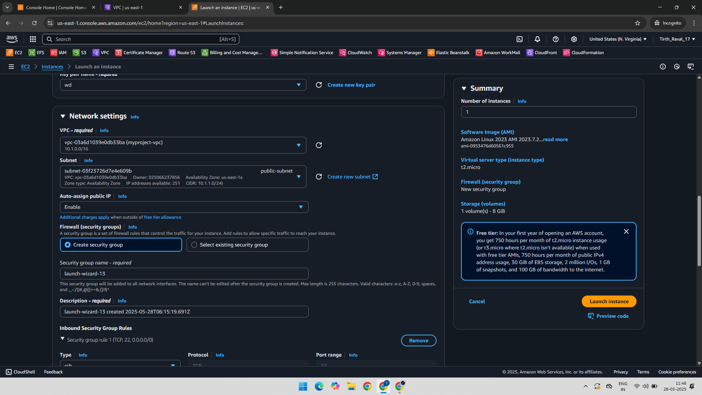

---

### 8️⃣ Launch Instance in Private Subnet

📷 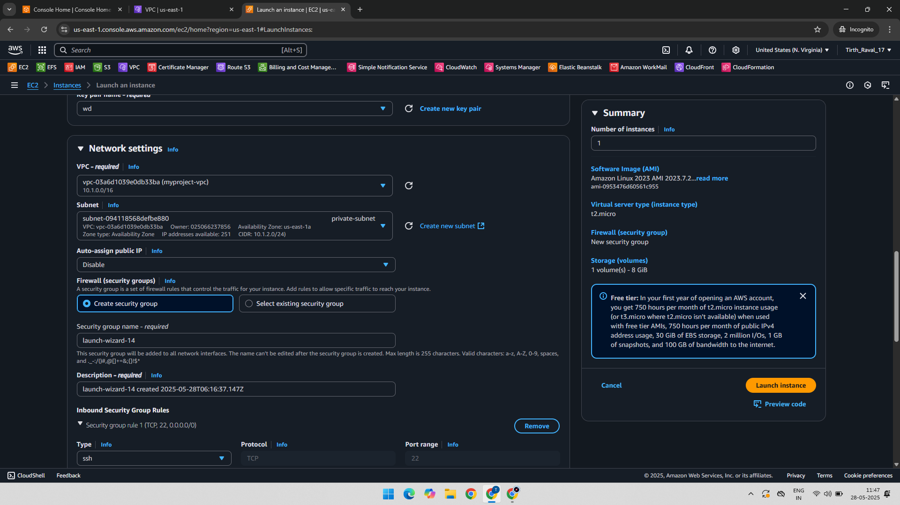

---

### 9️⃣ SSH into Public Instance Using Public IP

📷 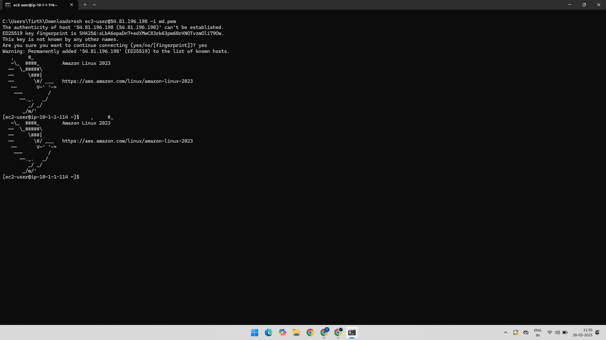

---

### 🔑 Copy Private Key to Bastion Host for SSH

- The private key for the private instance was copied into the Bastion Host.

📷 

---

### 🔒 Update Permissions for Private Key

📷 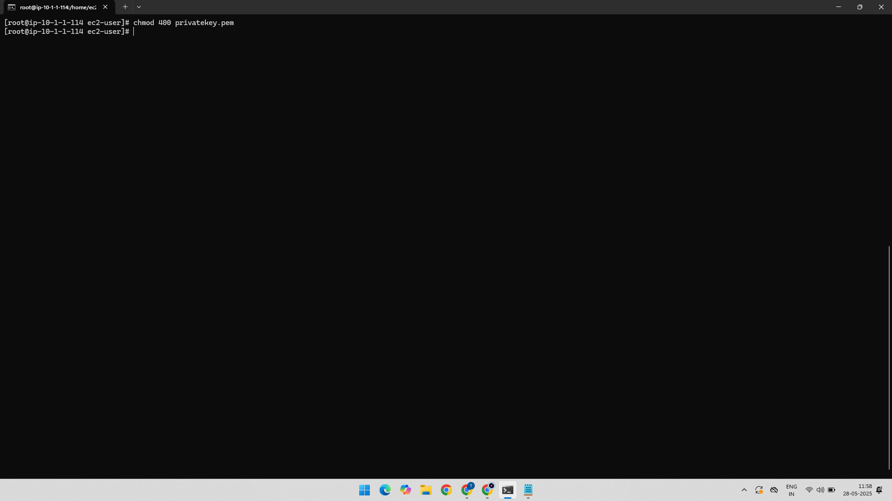

---

### 🔐 SSH into Private Instance via Private IP

SSH was successful from Bastion to the private EC2 instance using private IP.

📷 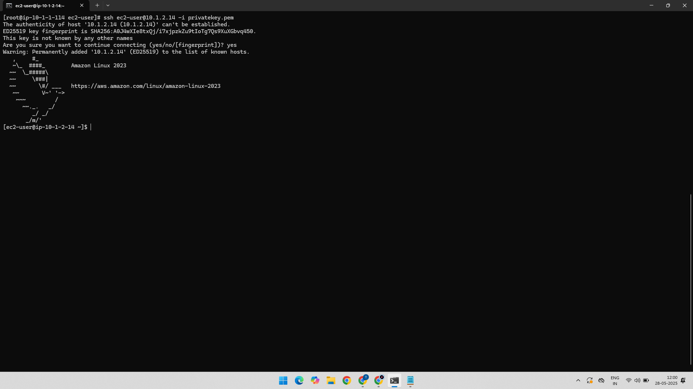

---

### 🌐 Create NAT Gateway

A NAT Gateway was launched in the public subnet with an Elastic IP for outbound internet.

📷 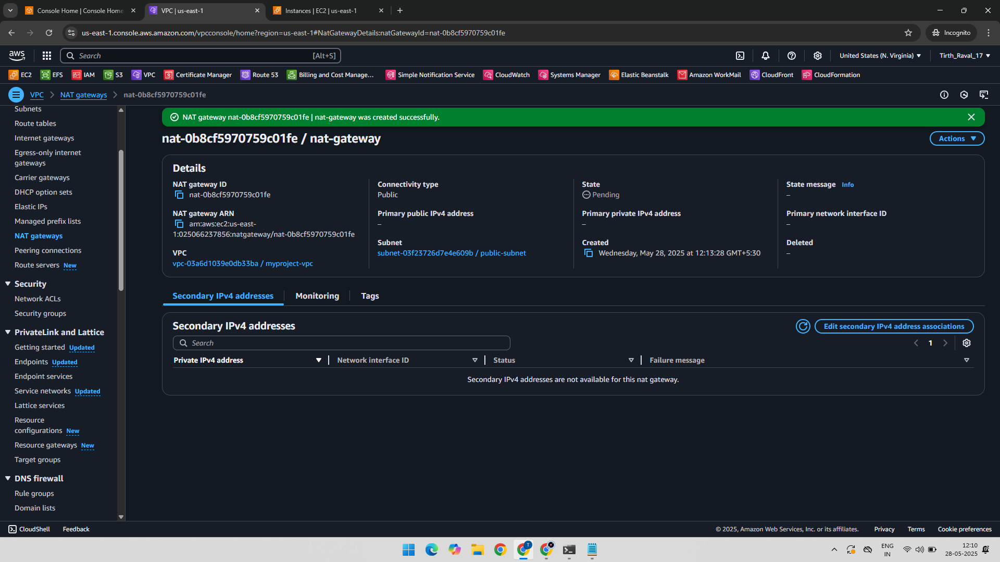

---

### 🛣️ Update Private Subnet Route Table with NAT Gateway

Added `0.0.0.0/0` route pointing to NAT Gateway in private route table.

📷 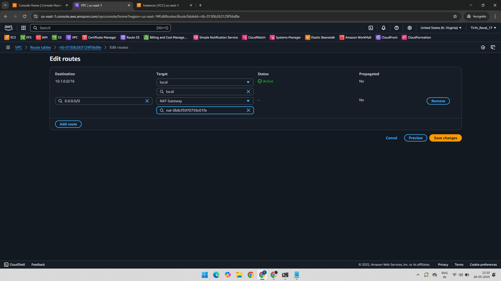

---

### ✅ Final Internet Access from Private Instance via NAT

Successfully connected to internet (e.g., via ping, yum update) from private instance using NAT.

📷 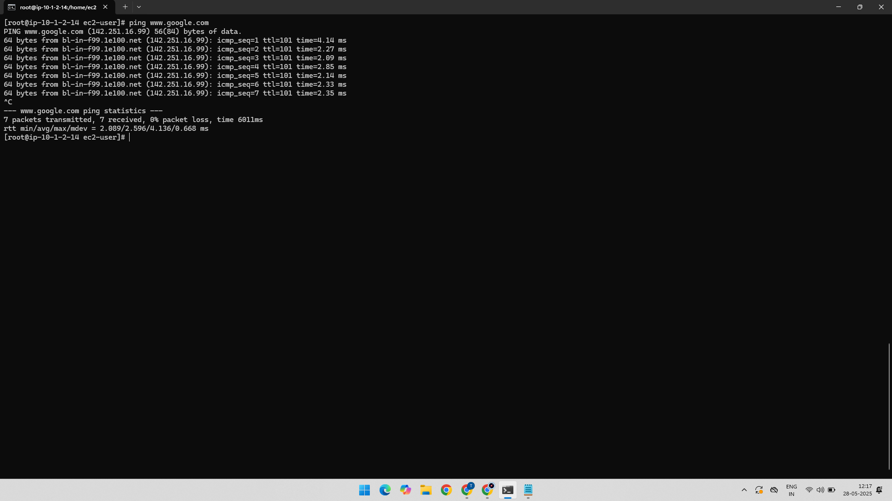

---

## ✅ Final Output

- Bastion Host setup via public subnet.
- Private instance access through Bastion.
- Internet connectivity from private instance via NAT Gateway.

---

## 📂 Folder Structure

AWS-VPC-Bastion-NAT-Gateway-Project/
├── 01-Public-Subnet.png
├── 02-Public-Subnet-Route-Table-IGW.png
├── 03-SubnetAssociation-Public-Subnet.png
├── 04-Private-Subnet.png
├── 05-Private-Subnet-Route-Table-Without-IGW.png
├── 06-SubnetAssociation-Private-Subnet.png
├── 07-Instance-with-Public-Subnet.png
├── 08-Instance-with-Private-Subnet.png
├── 09-SSH-with-Public-IP-of-Public-Subnet-Instance.png
├── 10-PrivateKey-PrivateInstance-Copy-PublicInstance.png
├── 11-Permission-to-PrivateKey.png
├── 12-SSH-with-Private-IP-Private-Instance.png
├── 13-NAT-Gateway.png
├── 14-Add-Routes-NAT-Gateway-In-Private-RouteTable.png
├── 15-Bastion-NAT-Gateway-Internet-Access.png
└── README.md
