# 🔐 AWS VPC - AWS Client VPN Endpoint with Certificate Authentication

## 📘 Project Overview

This project sets up an AWS Client VPN Endpoint with mutual authentication (certificate-based) for secure connectivity to a VPC. The steps include instance creation, certificate configuration (via Easy-RSA), AWS ACM uploads, and testing VPN access from a Windows client.

---

## 🛠️ AWS Services Used

- **Amazon VPC**
- **ACM (AWS Certificate Manager)**
- **EC2**
- **Client VPN Endpoint**
- **Security Groups & Target Networks**

---

## 🧪 Step-by-Step Implementation

### 1️⃣ Launch EC2 Linux Instance

📷 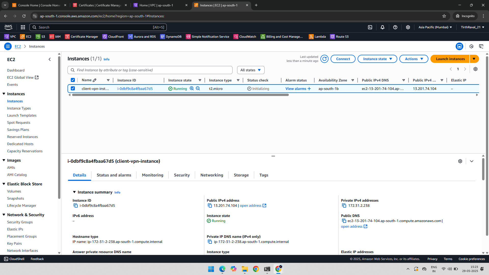

---

### 2️⃣ SSH into Instance

📷 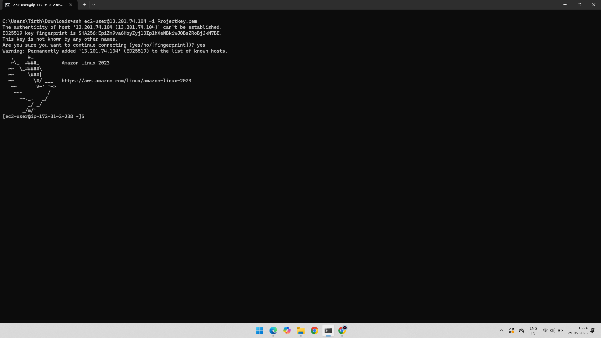

---

### ✅ Install Easy-RSA and Generate Certificates (Run inside EC2)

### ✅ Step 1: Install Easy-RSA

#### Install Git
sudo yum install git -y

#### Clone Easy-RSA and navigate to the directory
git clone https://github.com/OpenVPN/easy-rsa.git
cd easy-rsa/easyrsa3

---

### ✅ Step 2: Initialize PKI and Build CA

./easyrsa init-pki
./easyrsa build-ca nopass
#### When prompted for Common Name, press Enter or type something like "My-VPN-CA"

---

### ✅ Step 3: Generate the Server Certificate and Key

./easyrsa --san=DNS:server build-server-full server nopass
#### Generates:
#### - server.crt
#### - server.key
#### - ca.crt

---

### ✅ Step 4: Generate the Client Certificate and Key

./easyrsa build-client-full client1.domain.tld nopass
#### Generates:
#### - client1.domain.tld.crt
#### - client1.domain.tld.key
#### - ca.crt (reused)

---

### ✅ Step 5: Organize All Required Certificates into a Folder

mkdir ~/custom_folder/
cp pki/ca.crt ~/custom_folder/
cp pki/issued/server.crt ~/custom_folder/
cp pki/private/server.key ~/custom_folder/
cp pki/issued/client1.domain.tld.crt ~/custom_folder/
cp pki/private/client1.domain.tld.key ~/custom_folder/
cd ~/custom_folder/

---

3️⃣ Upload Server Certificate to ACM

📷 

---

4️⃣ Server Certificate Issued in ACM

📷 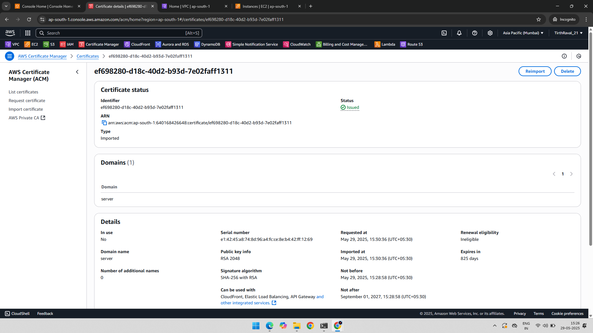

---

5️⃣ Upload Client Certificate to ACM

📷 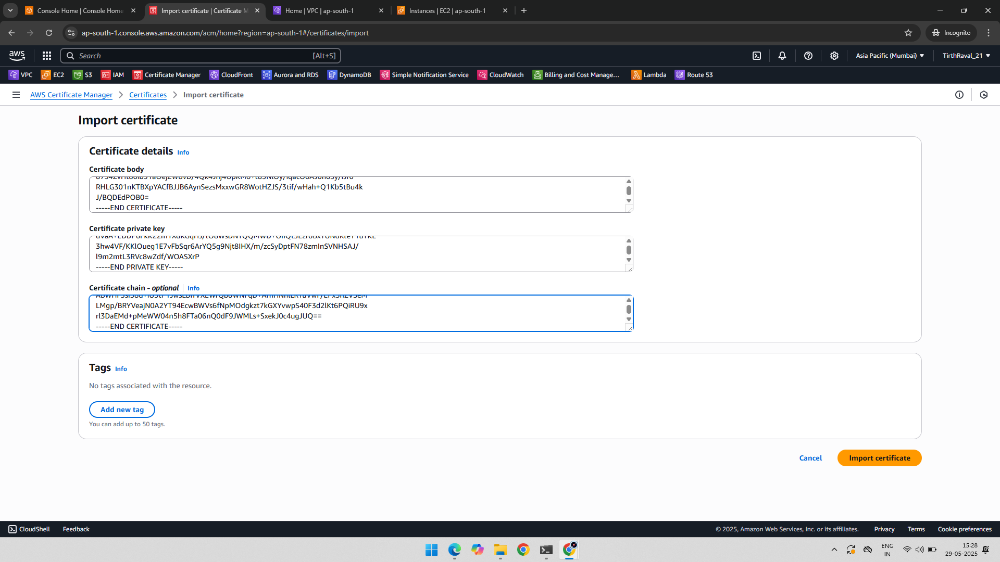

---

6️⃣ Client Certificate Issued in ACM

📷 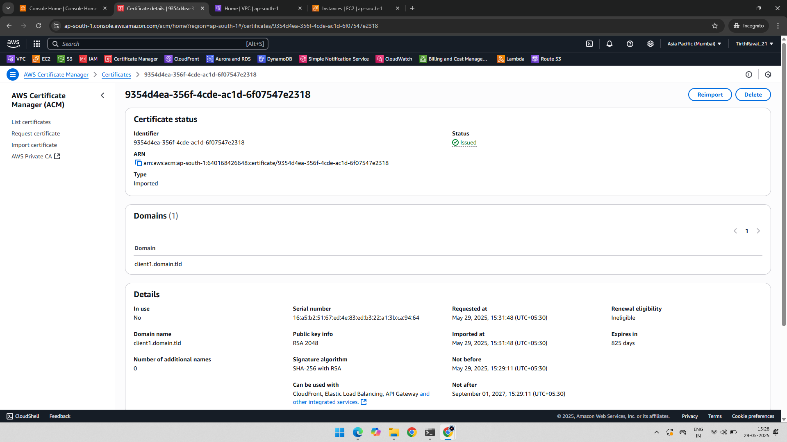

---

7️⃣ Add Authorization Rule

📷 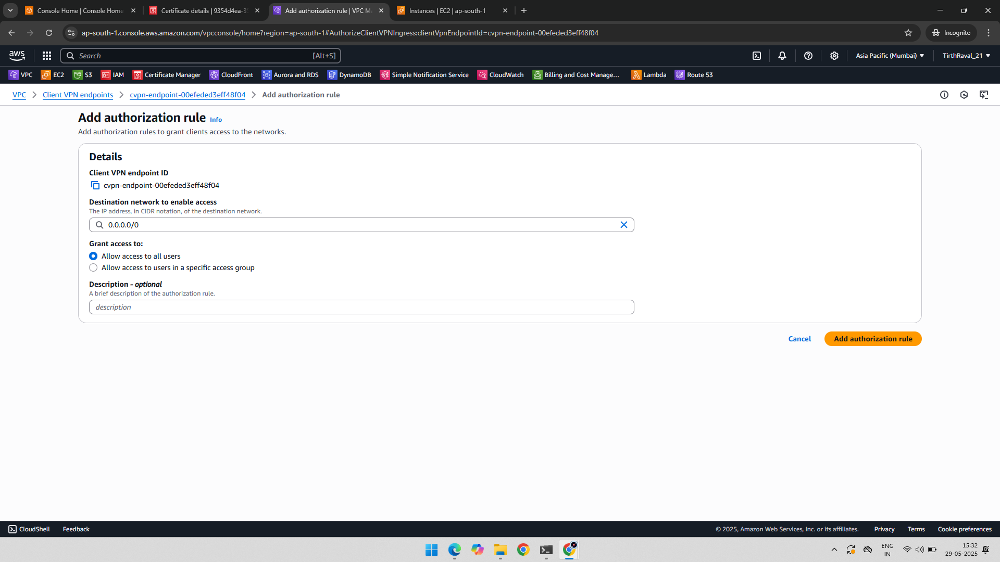

---

8️⃣ Associate Target Network

📷 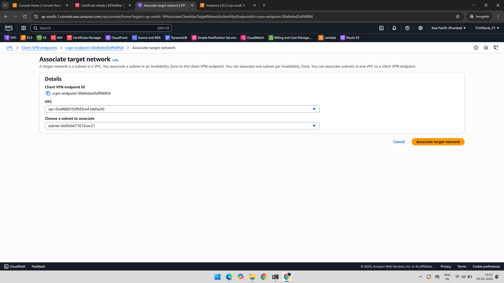

---

9️⃣ Client VPN Endpoint Created

📷 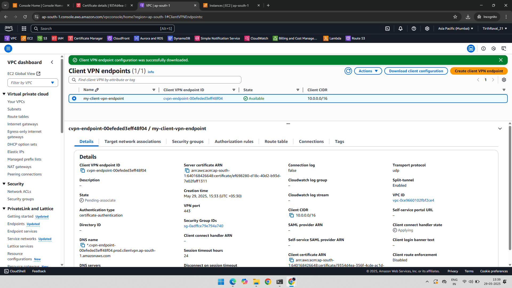

---

🔻 Download VPN Configuration

📷 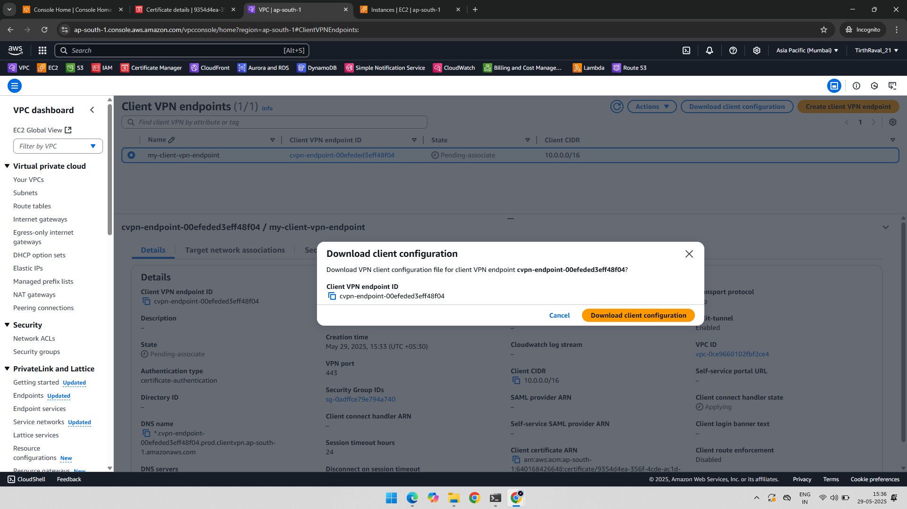

---

🧾 Add Client Certificate and Key to Config

📷 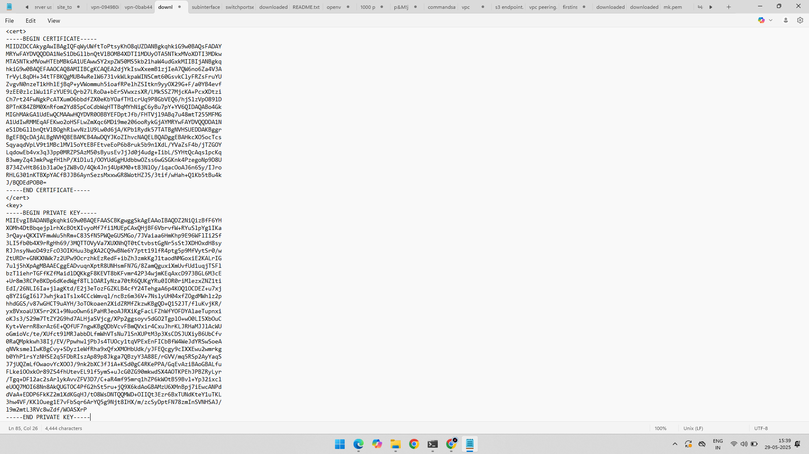

---

💻 Configure AWS VPN Client

📷 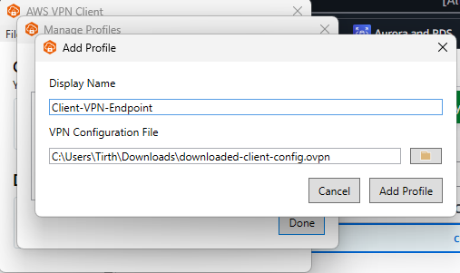

---

✅ Client VPN Connected

📷 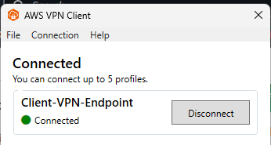

---

🌐 Confirm IP Assigned by VPN in Local PC

📷 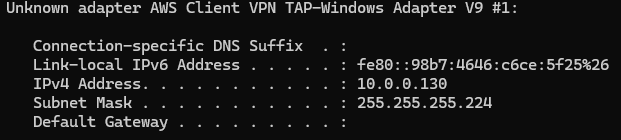

---

✅ Final Output

- VPN endpoint using mutual certificate authentication.
- Secure access to VPC from external client via VPN.
- Certificate management with Easy-RSA and ACM.
- Successfully tested using AWS VPN Client.

---

📂 Folder Structure
AWS-VPC-Client-VPN-Endpoint-Project/
├── 01-Created-Instance.png
├── 02-SSH-with-Public-IP.png
├── 03-Certificate-Configure-Server.png
├── 04-Certificate-Issued-Server.png
├── 05-Certificate-Configure-Client.png
├── 06-Certificate-Issued-Client.png
├── 07-Add-Authorization-Rule.png
├── 08-Associate-Target-Networks.png
├── 09-Created-Client-VPN-Endpoint.png
├── 10-Download-Configuration-File.png
├── 11-Client.crt-and-Client.key.png
├── 12-AWS-VPN-Client-Configuration.png
├── 13-Client-VPN-Endpoint-Connected.png
├── 14-IP-In-PC-Client-VPN-Endpoint.png
└── README.md
