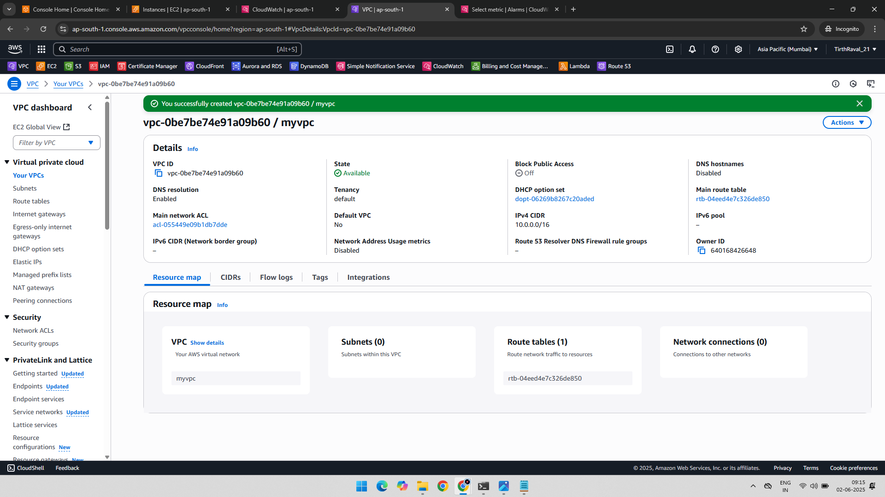
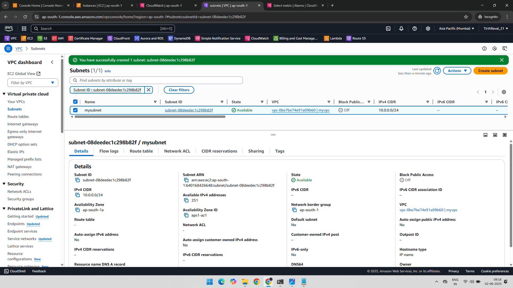
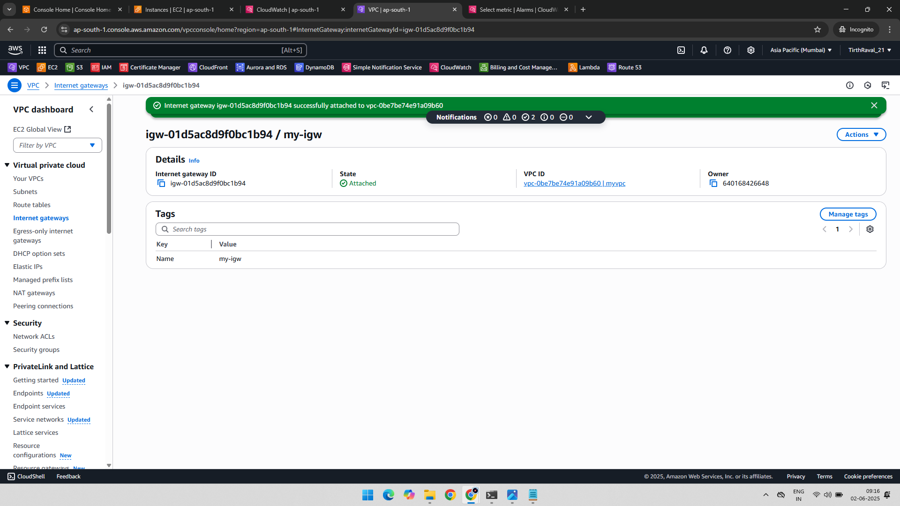
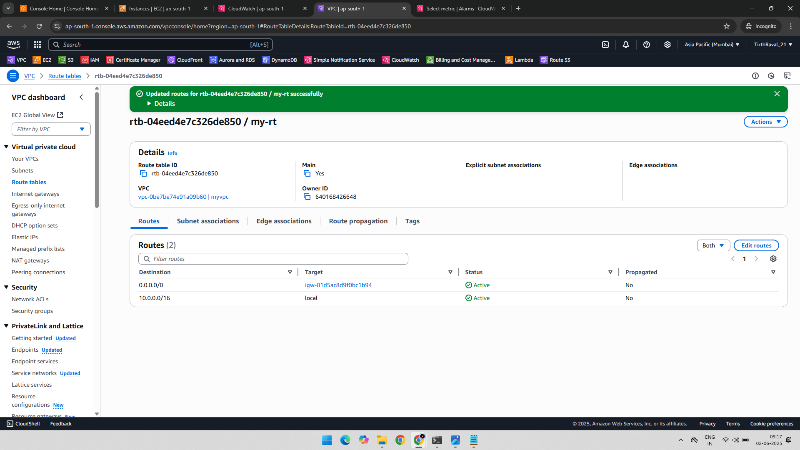
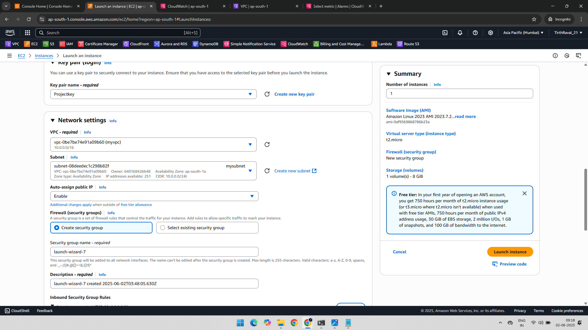

# 🌐 VPC-Project-1: Custom VPC with Public Subnet and Internet Access

## 📘 Project Overview

This project demonstrates how to create a custom Virtual Private Cloud (VPC) in AWS with a public subnet, attach an internet gateway, configure route tables, and launch an EC2 instance. 

---

## 🛠️ AWS Services Used

- Amazon VPC  
- Subnets  
- Internet Gateway  
- Route Table  
- EC2 Instance  

---

## 🧪 Step-by-Step Implementation

### 📌 Step 1: VPC Created

A new VPC is created with a custom CIDR block (e.g., `10.0.0.0/16`).

---

### 📌 Step 2: Subnet Created

A subnet is created inside the VPC, typically with CIDR `10.0.1.0/24`, and configured for a specific availability zone.

---

### 📌 Step 3: Internet Gateway Created and Attached to VPC

An Internet Gateway (IGW) is created and attached to the custom VPC to allow resources inside the VPC to access the public internet.

---

### 📌 Step 4: Add Route of Internet Gateway in Route Table

The route table is modified to include a rule that forwards traffic destined for `0.0.0.0/0` to the internet gateway.

---

### 📌 Step 5: Added Subnet in Subnet Association

The created public subnet is associated with the route table to ensure that instances in the subnet follow the defined routing rules.

---

### 📌 Step 6: Created Instance with Created VPC

An EC2 instance is launched within the public subnet, enabling it to access the internet using the IGW.

---

## ✅ Result

An EC2 instance running in a custom VPC with internet access is successfully deployed. This setup simulates a public web server environment or other publicly reachable AWS resources.

---

## 📂 Folder Structure

AWS-VPC-Create-Custom-VPC-Subnet-IGW-RouteTable/
├── 01-VPC-Created.png
├── 02-Subnet-Created.png
├── 03-Internet-Gateway-Created-&-Attach-to-VPC.png
├── 04-Add-Route-of-Internet-Gateway-in-Route-Table.png
├── 05-Added-Subnet-in-SubnetAssociation.png
├── 06-Created-Instance-with-Created-VPC.png
└── README.md
