# 🔐 AWS-VPC-OpenVPN Setup for Remote Access

## 📘 Project Overview

This project demonstrates how to set up a secure OpenVPN server on AWS within a VPC using a Windows EC2 instance. 

---

## 🧰 AWS Services Used

- **Amazon VPC**
- **Public Subnet**
- **Windows EC2 Instance**
- **OpenVPN Access Server**
- **PuTTY & Key Generator**
- **PuTTY Configuration**
- **OpenVPN Client (Mobile/Desktop)**

---

## 🔧 Step-by-Step Implementation

### 1️⃣ Create Public & Private Subnets

📷 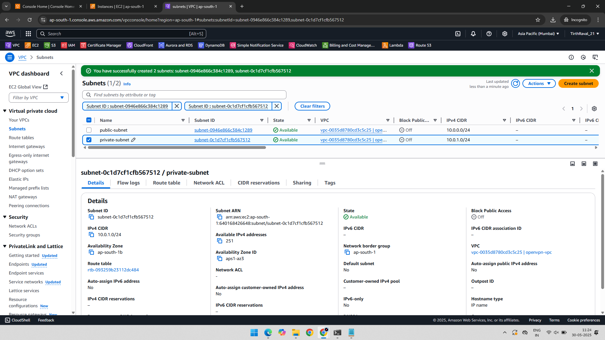

---

### 2️⃣ Configure Route Table for VPC

📷 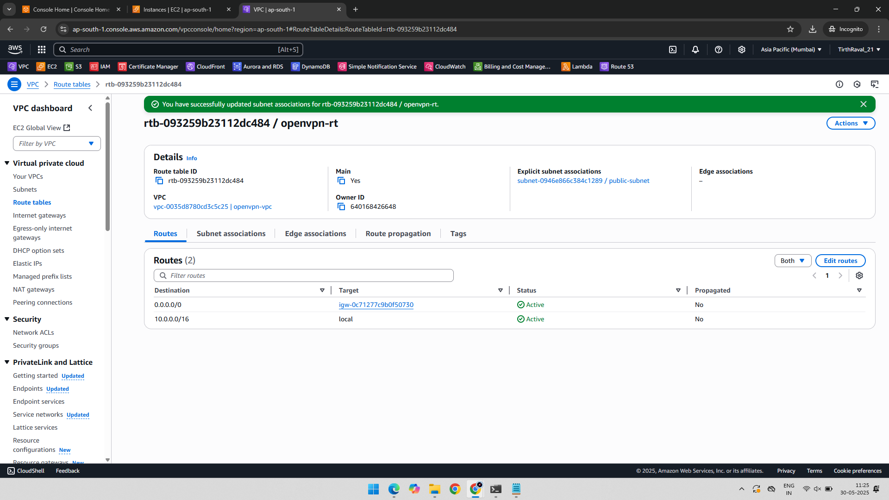

---

### 3️⃣ Launch Windows EC2 Instance

📷 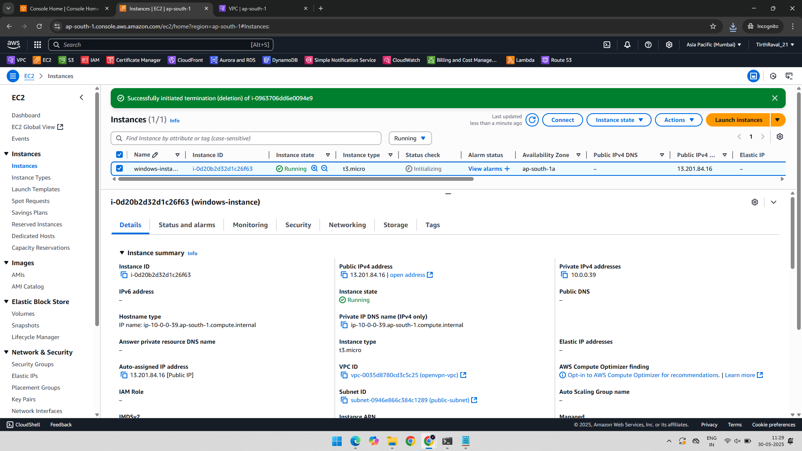

---

### 4️⃣ Decrypt the Password for Windows EC2

📷 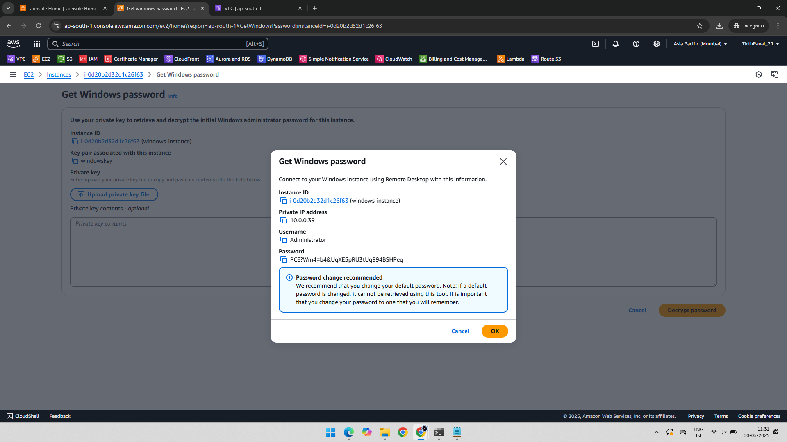

---

### 5️⃣ Launch OpenVPN AMI

📷 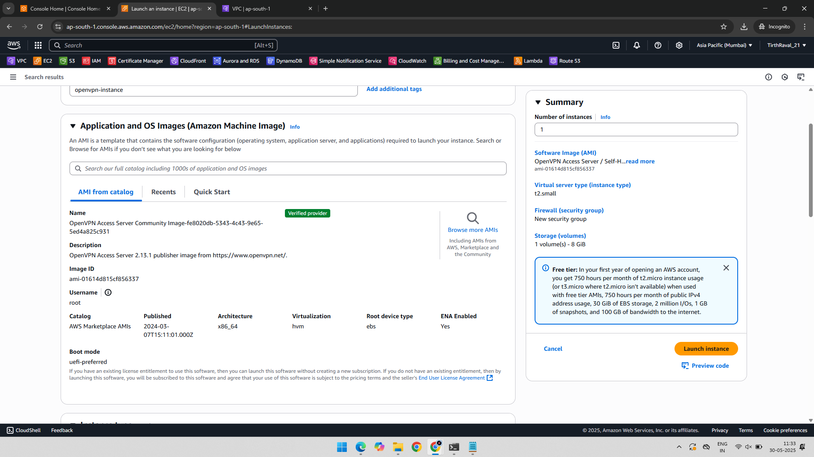

---

### 6️⃣ OpenVPN Instance Created

📷 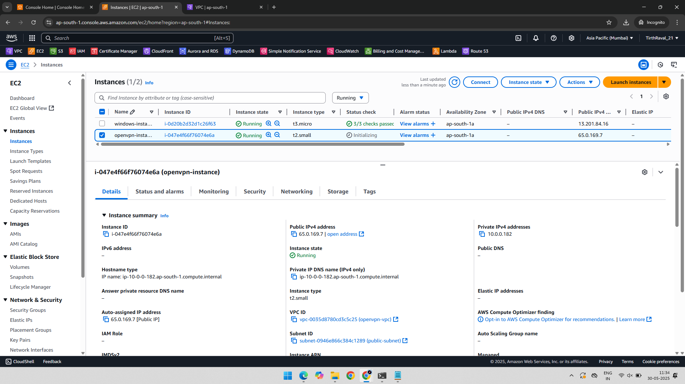

---

### 7️⃣ Generate `.ppk` Key Using PuTTYgen

📷 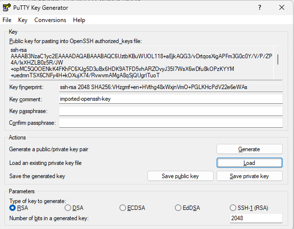

---

### 8️⃣ `.ppk` Key File Created

📷 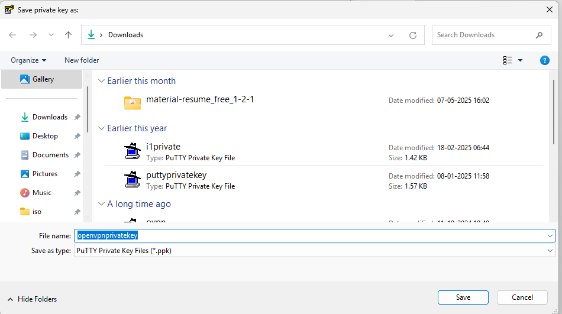

---

### 9️⃣ Configure PuTTY to Use the Public IP

📷 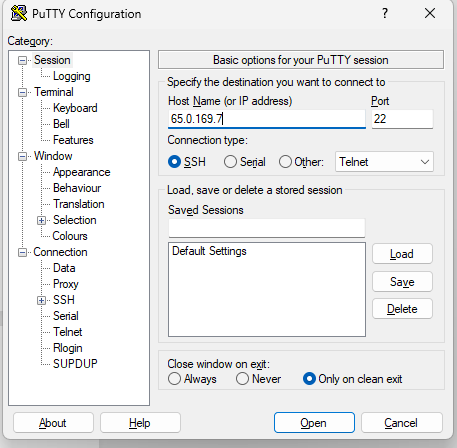

---

### 🔟 Set Path to `.ppk` Key in PuTTY

📷 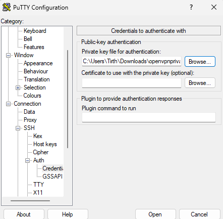

---

### 1️⃣1️⃣ Accept PuTTY Security Alert

📷 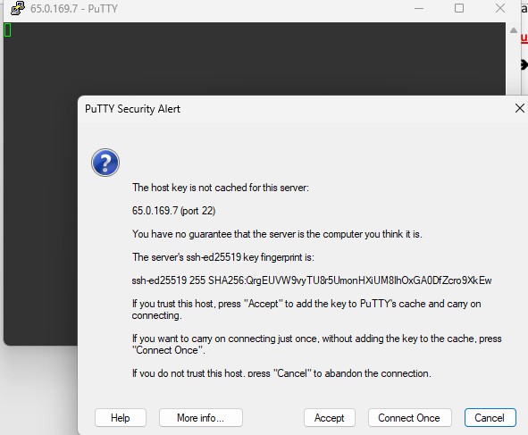

---

### 1️⃣2️⃣ Log in with OpenVPN Default User

📷 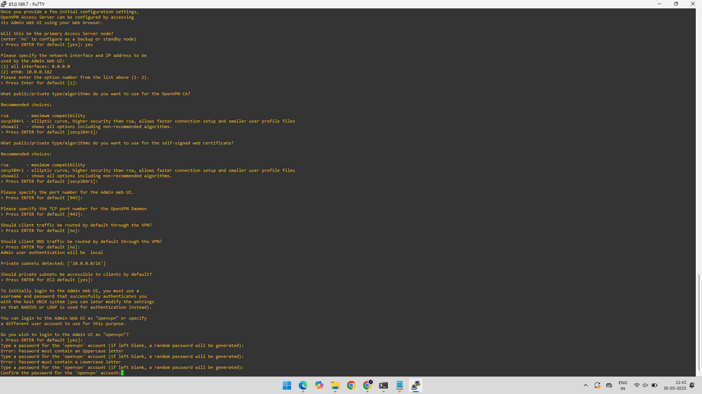

---

### 1️⃣3️⃣ OpenVPN URL Generated

📷 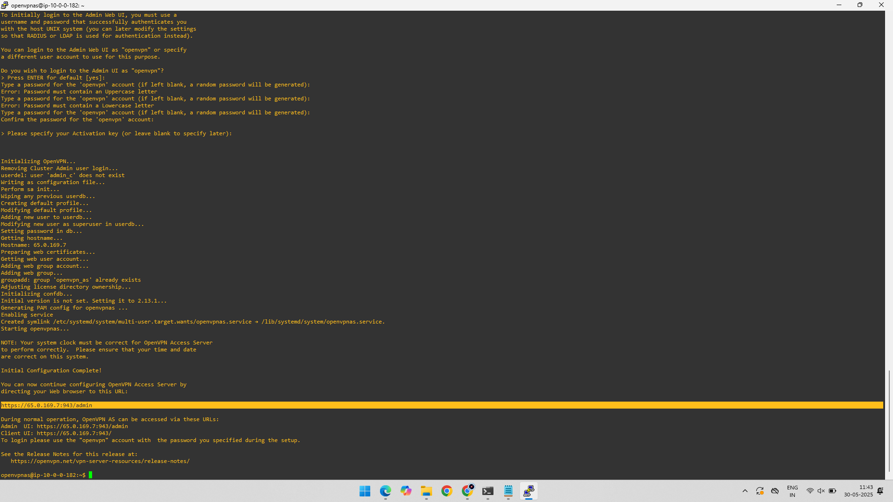

---

### 1️⃣4️⃣ Access URL in OpenVPN Client

📷 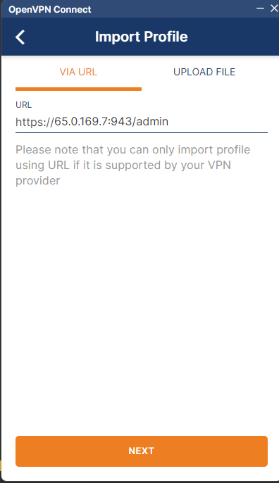

---

### 1️⃣5️⃣ Import Username & Password into Client

📷 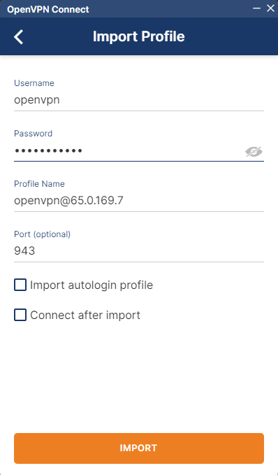

---

### 1️⃣6️⃣ VPN Connected Successfully

📷 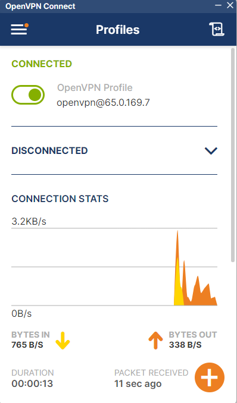

---

### 1️⃣7️⃣ Remote Desktop: Enter Computer & Username

📷 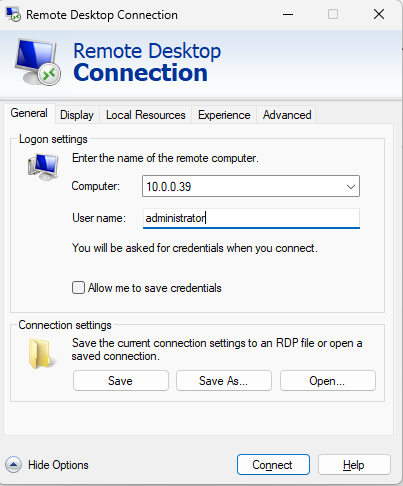

---

### 1️⃣8️⃣ Give Decrypted Password 

📷 

---

### 1️⃣9️⃣ Successfully Connected to Windows Instance via VPN

📷 

---

### 2️⃣0️⃣ Disconnected VPN than Windows Instance Remote Connection Disconnected

📷 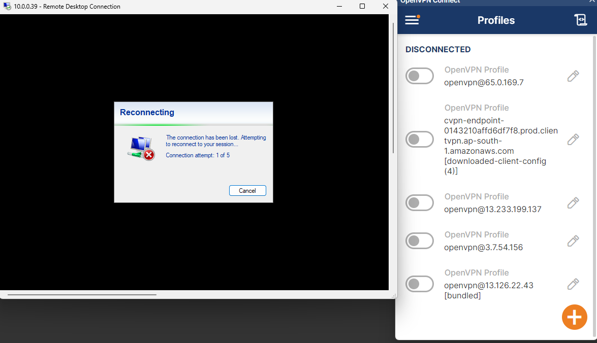

---

## ✅ Outcome

- OpenVPN Access Server successfully deployed on AWS.
- Connected securely using OpenVPN Connect client.
- Remotely accessed Windows EC2 instance over VPN.

---

## 📁 Folder Structure

AWS-VPC-OpenVPN-Remote-Access/
├── 01-Public-Private-Subnet-Creation.png
├── 02-Route-Table-of-Created-VPC.png
├── 03-Windows-Instance-Created.png
├── 04-Windows-Instance-Decrypted-Password.png
├── 05-AMI-For-OpenVPN.png
├── 06-OpenVPN-Instance-Created.png
├── 07-Creating-.ppk-Key-For-OpenVPN.png
├── 08-.ppk-Key-Created.png
├── 09-Public-IP-OpenVPN-Instance-Putty-Configuration.png
├── 10-Path-to-.ppk-Key-Putty-Configuration.png
├── 11-Putty-Security-Alert-Accept.png
├── 12-Give-Password-OpenVPN-Account.png
├── 13-Generated-URL.png
├── 14-Put-URL-in-OpenVPN-Connect.png
├── 15-Username-Password-Import.png
├── 16-Connected.png
├── 17-Remote-Desktop-Connection-Computer-Username-Connect.png
├── 18-Give-Decrypt-Windows-Password.png
├── 19-Connected-To-Windows-Instance.png
├── 20-OpenVPN-Disconnected-Windows-Server-Disconnected.png
├── README.md
