# 🌐 AWS VPC Peering Across Regions: Mumbai ↔ Singapore

## 📘 Project Overview

This project demonstrates how to create a **VPC peering connection between two AWS regions**: **Mumbai** and **Singapore**. It involves setting up VPCs, subnets, EC2 instances in each region, configuring route tables, and validating the peering connection through successful ping tests.

---

## 🧰 AWS Services Used

- **Amazon VPC**
- **Subnets**
- **EC2 Instances (Amazon Linux)**
- **VPC Peering**
- **Security Groups**
- **Route Tables**

---

## 🌍 Region Information

- **Mumbai Region (ap-south-1)**  
- **Singapore Region (ap-southeast-1)**

---

## 🔧 Step-by-Step Implementation

### 1️⃣ Create VPC in Mumbai Region

📷 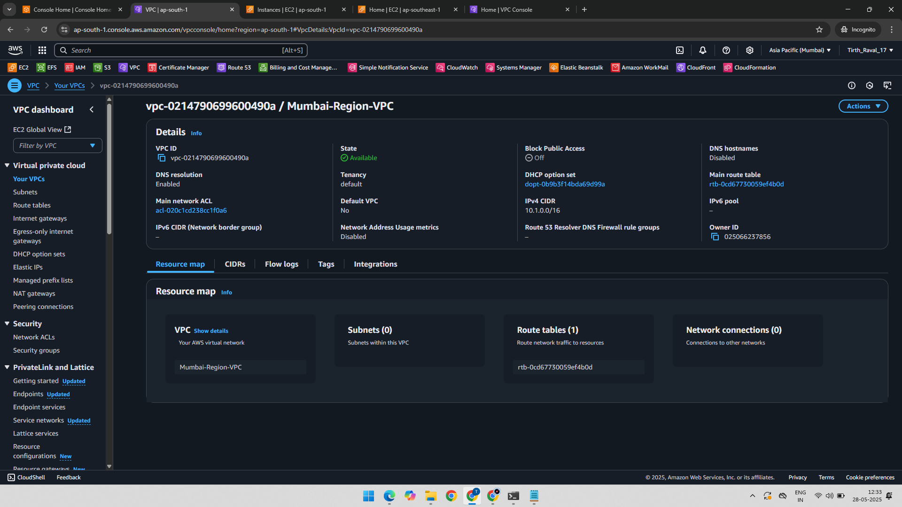

---

### 2️⃣ Create Subnet in Mumbai VPC

📷 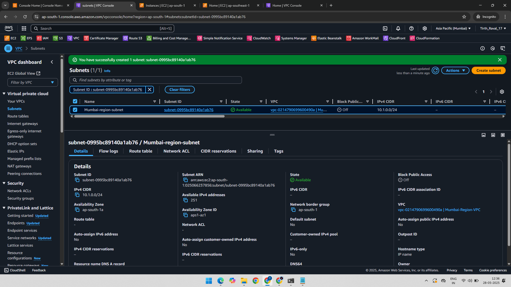

---

### 3️⃣ Launch EC2 Instance in Mumbai Region

📷 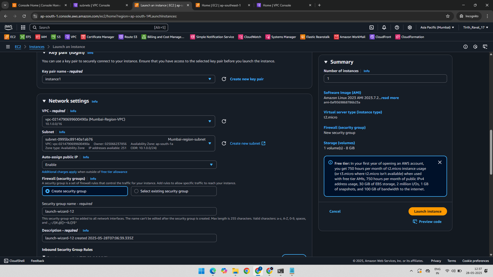

---

### 4️⃣ Create VPC in Singapore Region

📷 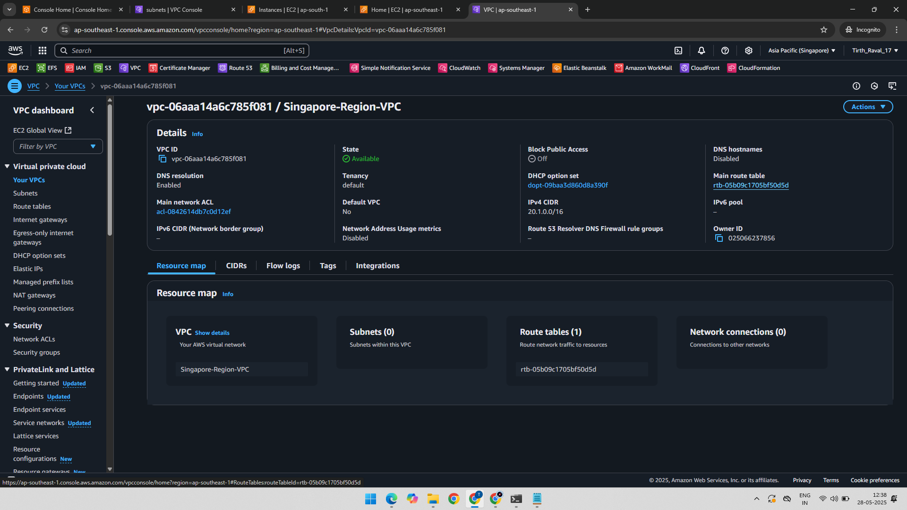

---

### 5️⃣ Create Subnet in Singapore VPC

📷 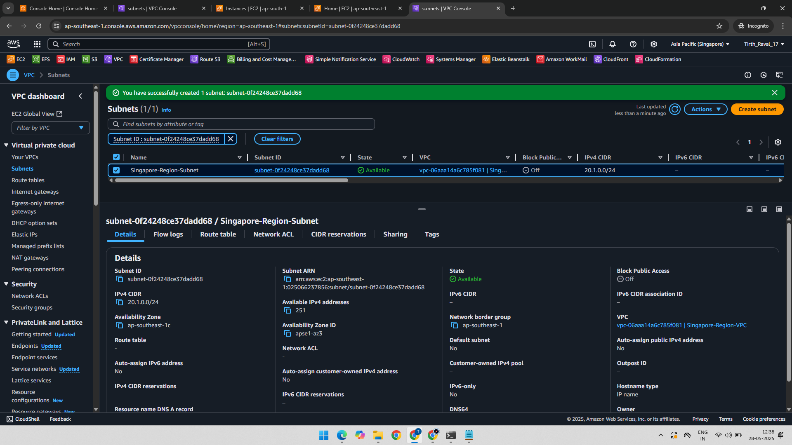

---

### 6️⃣ Launch EC2 Instance in Singapore Region

📷 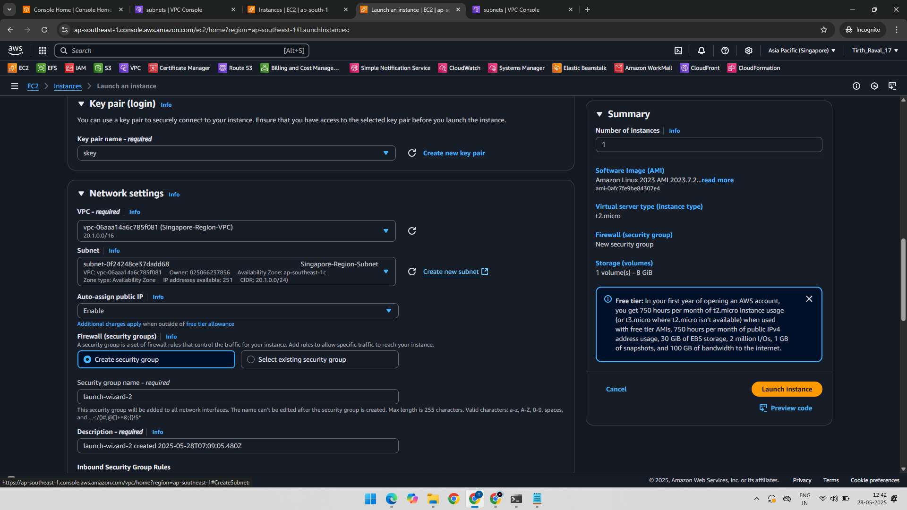

---

### 7️⃣ Create VPC Peering Request from Mumbai

📷 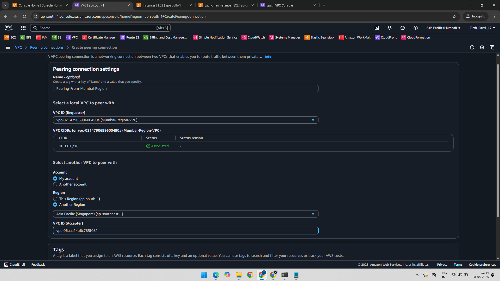

---

### 8️⃣ Accept Peering Request in Singapore

📷 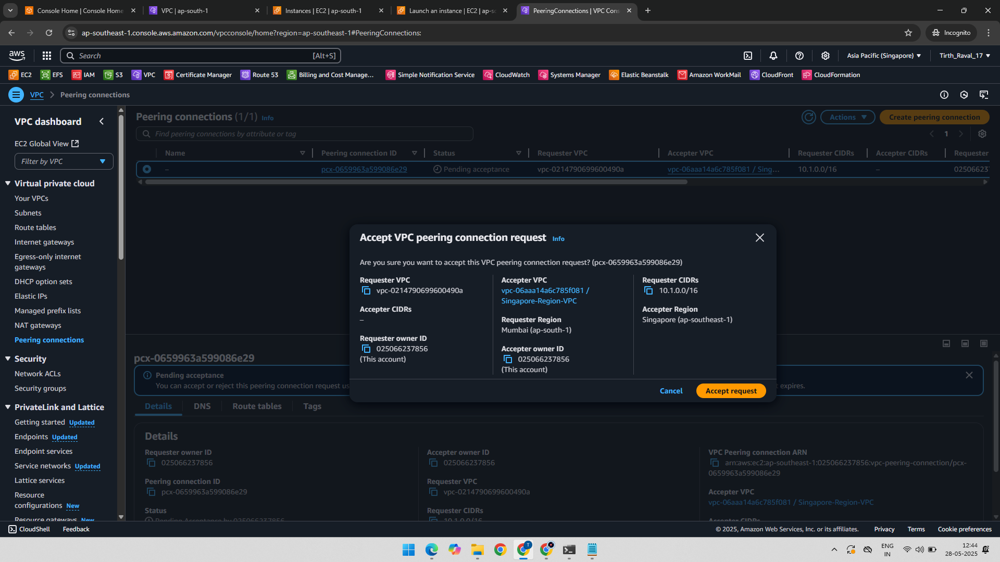

---

### 9️⃣ Modify Mumbai Route Table (Peering + IGW)

📷 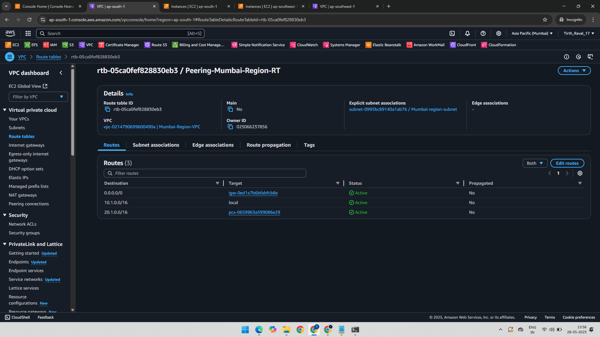

---

### 🔟 Modify Singapore Route Table (Peering + IGW)

📷 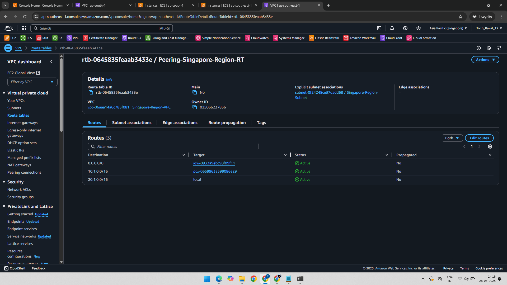

---

### 1️⃣1️⃣ Ping from Mumbai to Singapore (Private IP)

📷 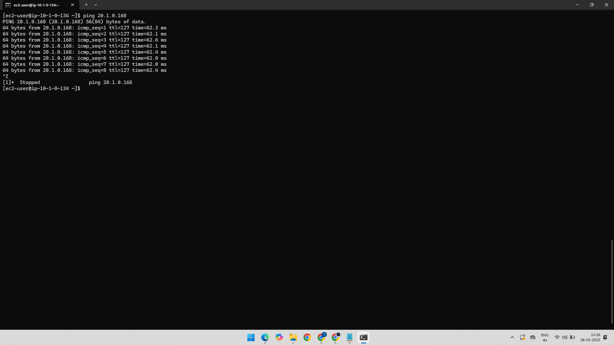

✅ **Success** – Indicates correct peering and route setup.

---

### 1️⃣2️⃣ Ping from Singapore to Mumbai (Private IP)

📷 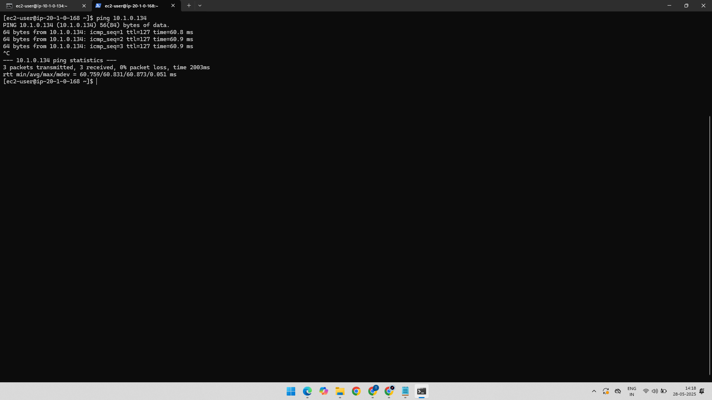

✅ **Success** – Full bi-directional connectivity verified.

---

## 📁 Folder Structure

AWS-VPC-Peering-Mumbai-Singapore/
├── 01-VPC-Mumbai-Region.png
├── 02-Subnet-Mumbai-Region.png
├── 03-Instance-Created-with-Mumbai-Region-VPC.png
├── 04-VPC-Singapore-Region.png
├── 05-Subnet-Singapore-Region.png
├── 06-Instance-Created-with-Singapore-Region-VPC.png
├── 07-VPC-Peering-Creating-In-Mumbai-Region.png
├── 08-VPC-Peering-Request-Accepted-Singapore-Region.png
├── 09-Mumbai-Region-Route-Table-IGW-Peering-Connection-Subnet-Association.png
├── 10-Singapore-Region-Route-Table-IGW-PeeringConnection-Subnet-Association.png
├── 11-Ping-From-Mumbai-Region-Instance-to-Singapore-Region-Private-IP.png
├── 12-Ping-From-Singapore-Region-Instance-to-Mumbai-Region-Private-IP.png
├── README.md
