# ☁️ AWS S3 Access from Private EC2 Using VPC Endpoint

## 📘 Project Overview

This project demonstrates how a private EC2 instance (with no internet access) can access an S3 bucket using an **Interface VPC Endpoint for S3**. The setup includes creating a VPC, subnets, instances, S3 bucket, endpoint configuration, and final validation.

---

## 🛠️ AWS Services Used

- **Amazon VPC**
- **Subnets (Public & Private)**
- **EC2 Instances**
- **Amazon S3**
- **IAM Access Key**
- **VPC Endpoint for S3**
- **Security Groups & Route Tables**

---

## 🧪 Step-by-Step Implementation

### 1️⃣ VPC Creation

📷 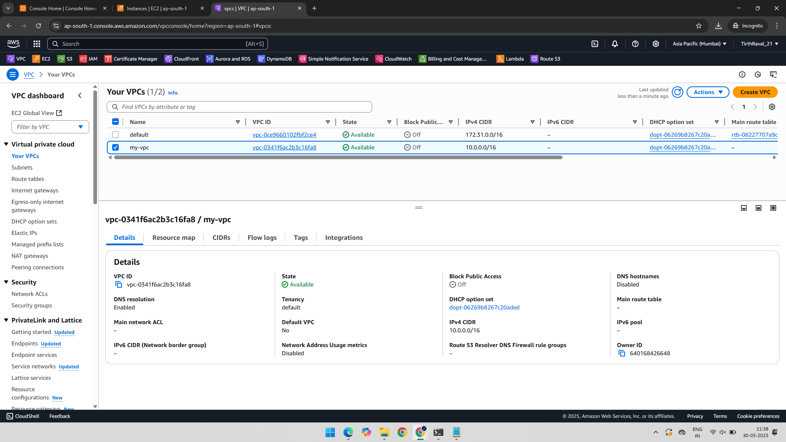

---

### 2️⃣ Public & Private Subnet Creation

📷 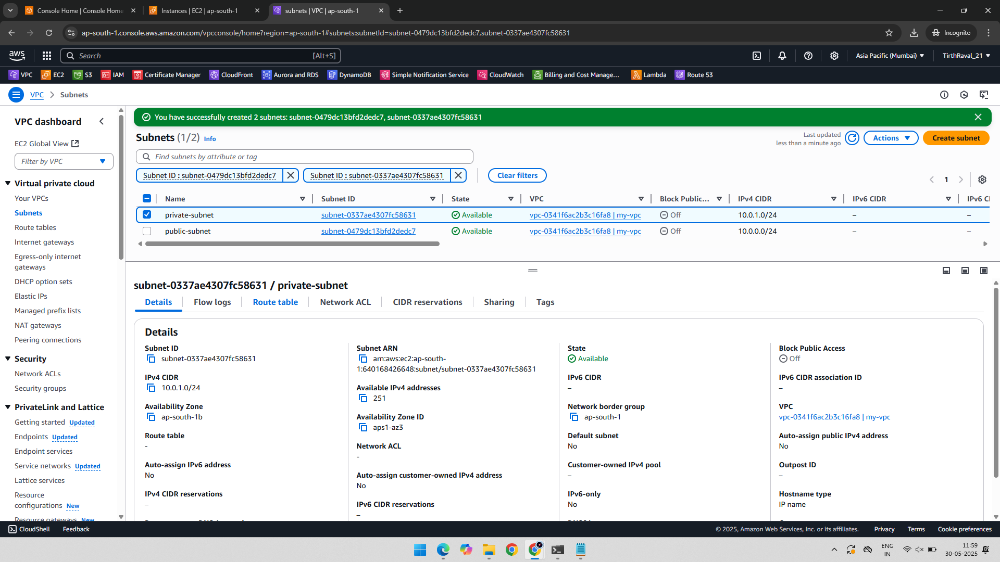

---

### 3️⃣ Route Table Configuration

📷 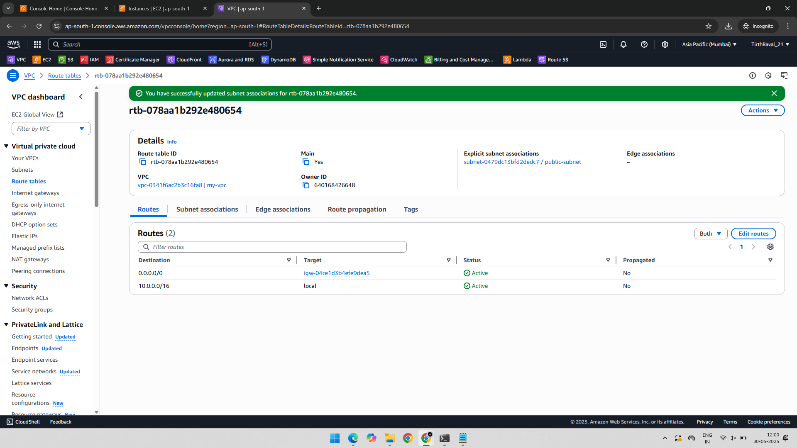

---

### 4️⃣ Launch Public EC2 Instance

📷 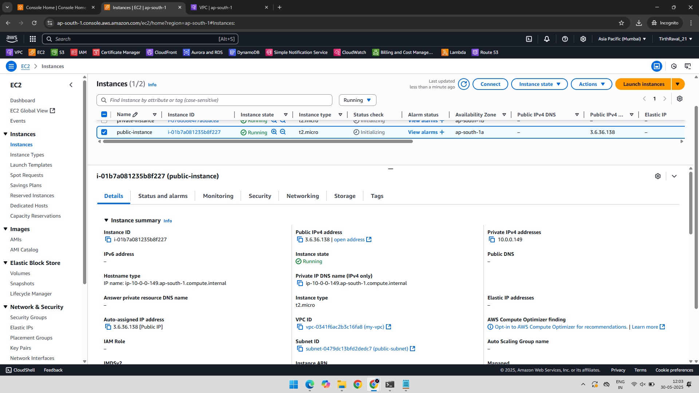

---

### 5️⃣ Launch Private EC2 Instance

📷 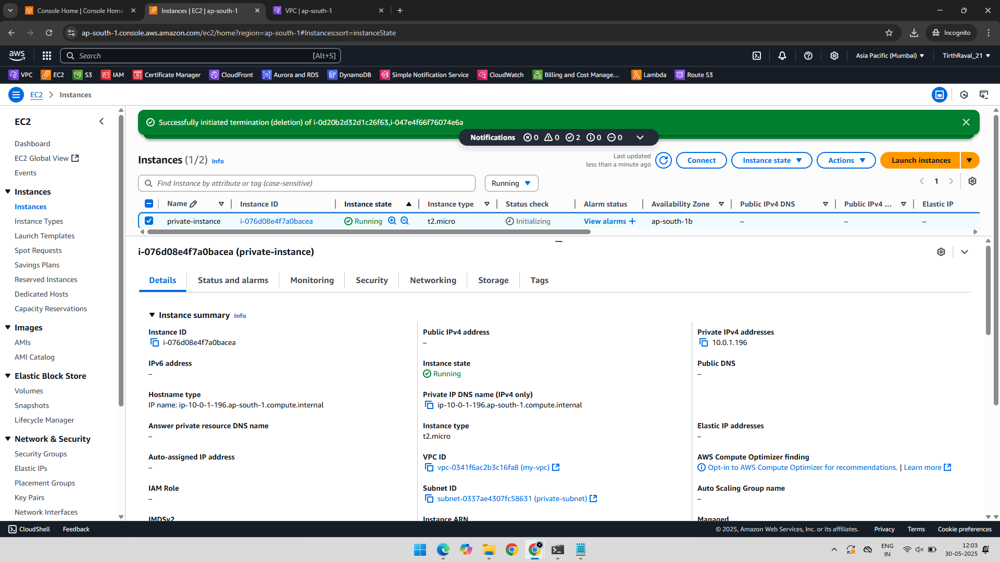

---

### 6️⃣ Create S3 Bucket and Upload Object

📷 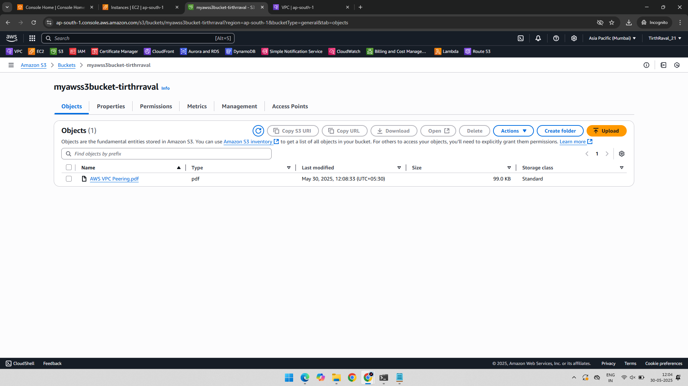

---

### 7️⃣ Create Access Key in IAM

📷 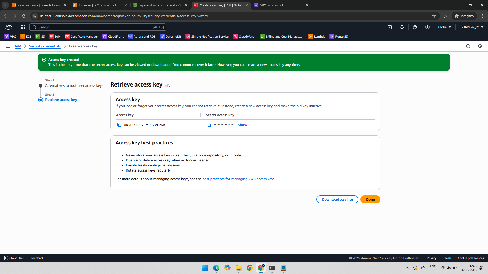

---

### 8️⃣ SSH into Public Instance

📷 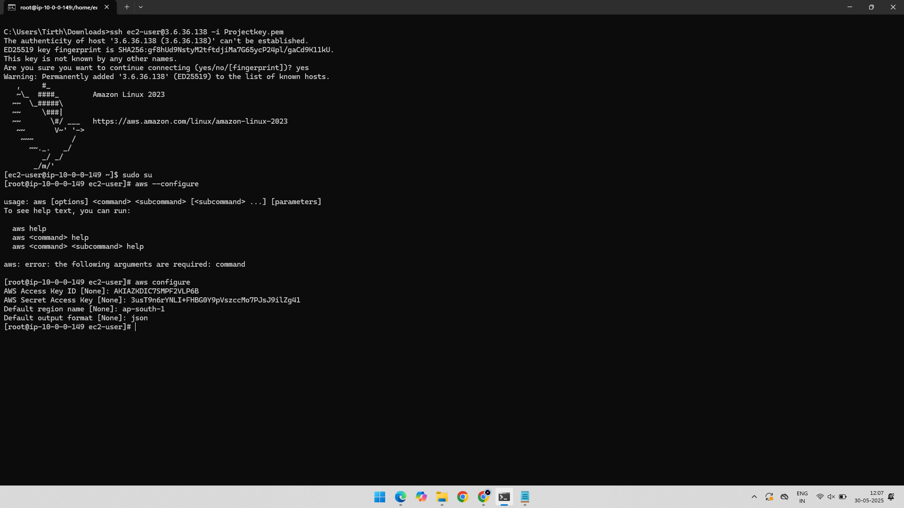

---

### 9️⃣ Copy Private Key for Accessing Private Instance

📷 

---

### 🔟 SSH into Private Instance using Private IP

📷 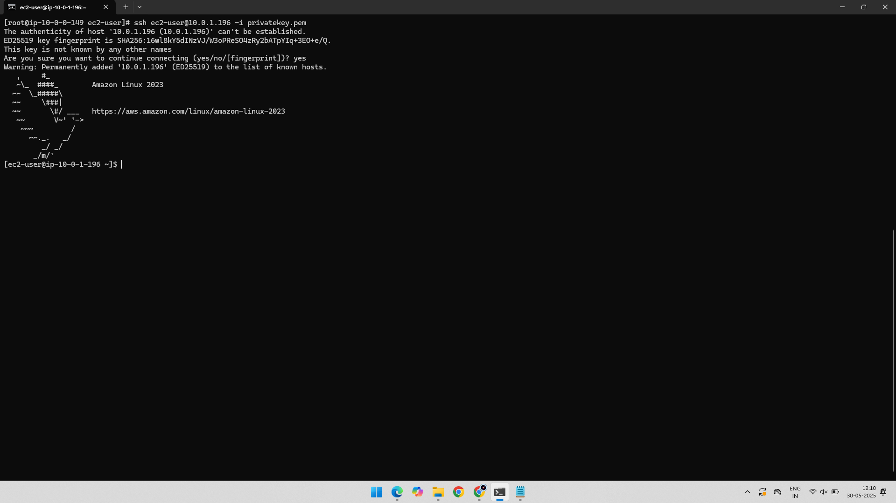

---

### 1️⃣1️⃣ AWS CLI Configured but S3 Bucket Not Visible

📷 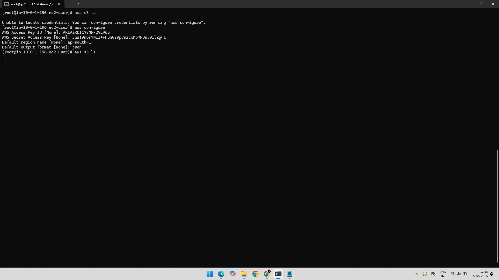

---

### 1️⃣2️⃣ Create VPC Endpoint for S3

📷 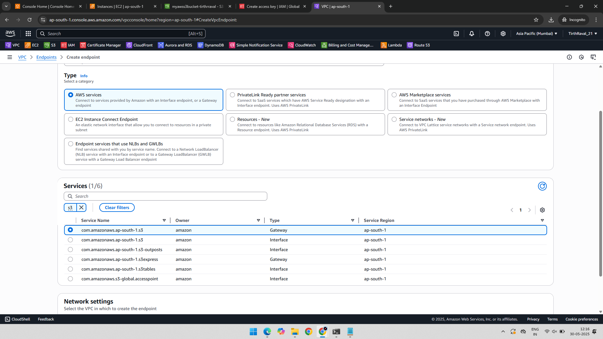

---

### 1️⃣3️⃣ Select Route Table and VPC for Endpoint

📷 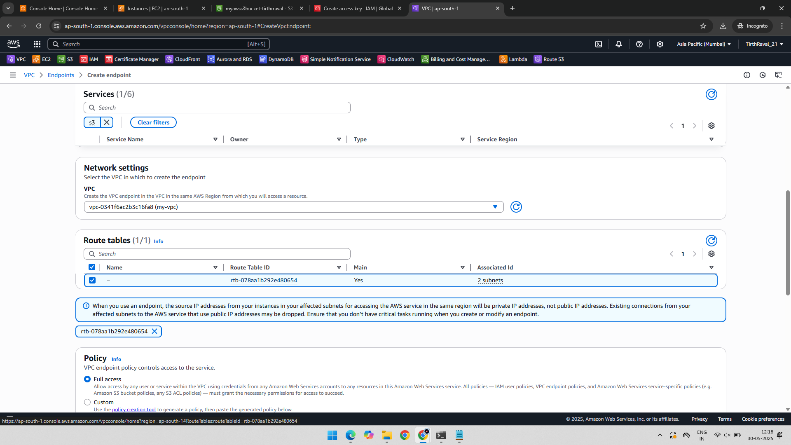

---

### 1️⃣4️⃣ VPC Endpoint Successfully Created

📷 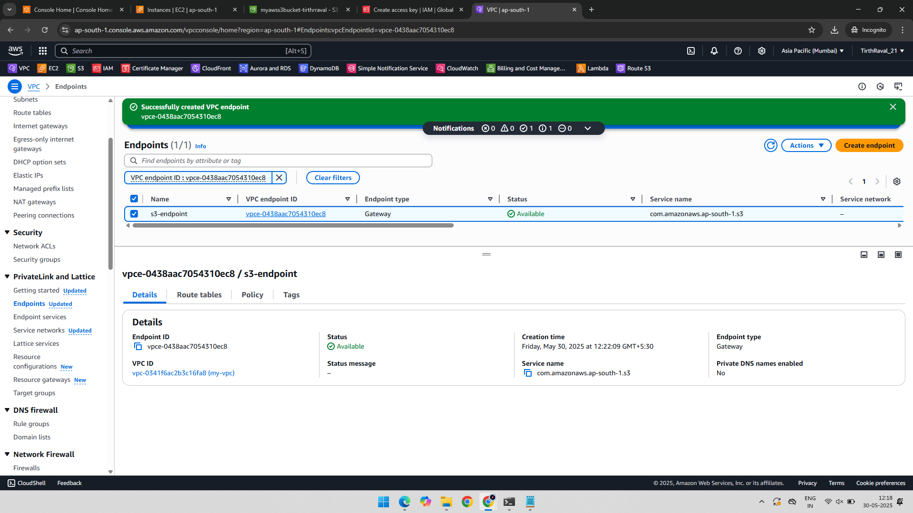

---

### 1️⃣5️⃣ S3 Bucket Now Listed in Private Instance

📷 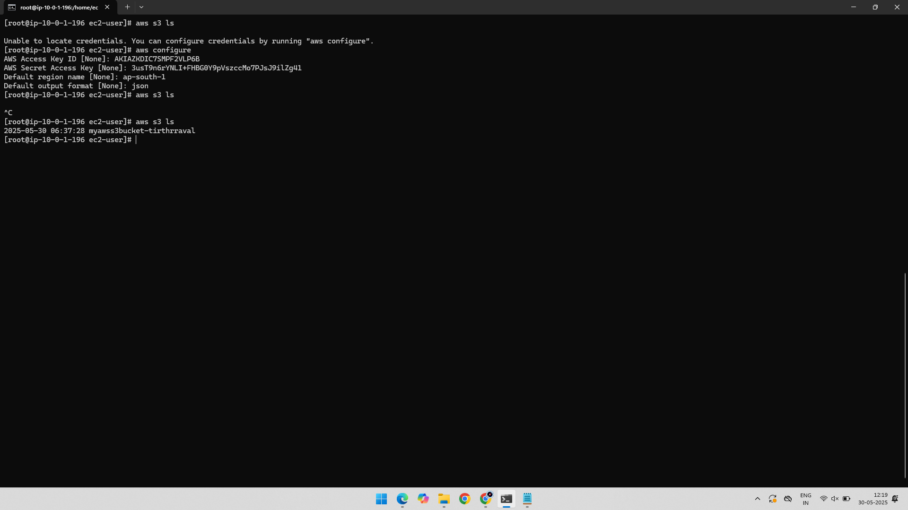

---

## ✅ Final Output

- The private EC2 instance could not access the S3 bucket initially.
- After configuring the **VPC Endpoint for S3**, access was granted without requiring an internet gateway or NAT.
- This setup is secure and scalable for private EC2 to S3 communication.

---

## 📂 Folder Structure

AWS-VPC-S3-VPC-Endpoint-PrivateEC2/
├── 01-Created-VPC.png
├── 02-Public-Private-Subnet.png
├── 03-Created-VPC-Route-Table.png
├── 04-Public-Instance.png
├── 05-Private-Instance.png
├── 06-Created-S3Bucket-With-Object.png
├── 07-Created-AccessKey.png
├── 08-SSH-Public-IP-Public-Instance.png
├── 09-Copy-Private-Key-of-Private-Instance.png
├── 10-SSH-with-Private-IP-Private-Instance.png
├── 11-AWS-Configure-Still-Not-Showing-Bucket.png
├── 12-Creating-Endpoint.png
├── 13-Network-Setting-Select-Created-VPC-&-Route-Table.png
├── 14-Endpoint-For-S3-Created.png
├── 15-Now-Bucket-Listed-in-Private-Instance.png
├── README.md
