# 🔐 AWS VPC - Site-To-Site VPN Connection

## 📘 Project Overview

This project demonstrates how to set up a Site-to-Site VPN connection between an AWS VPC and an On-Premises network. It includes creating VPCs, gateways, route tables, EC2 instances, VPN connection setup, and connectivity testing via SSH and ping.

---

## 🛠️ AWS & On-Premises Components Used

- **Virtual Private Gateway (VGW)**
- **Customer Gateway (CGW)**
- **VPN Connection**
- **Route Tables (AWS and On-Premises)**
- **EC2 Instances (AWS-side and On-Premises-side)**
- **Security Groups**

---

## 🧪 Step-by-Step Implementation

### 1️⃣ AWS VPC Created

📷 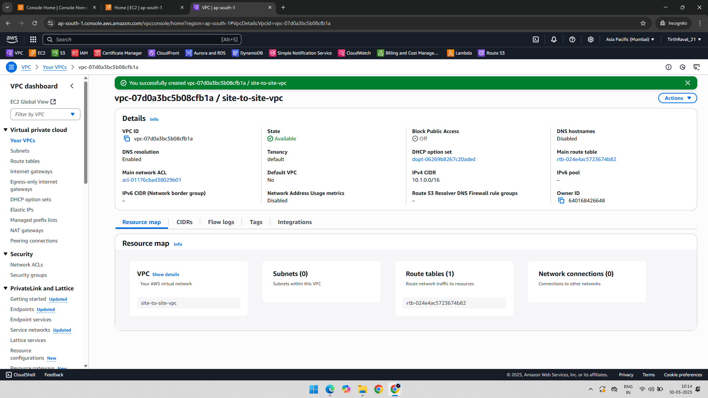

---

### 2️⃣ AWS Route Table Configured

📷 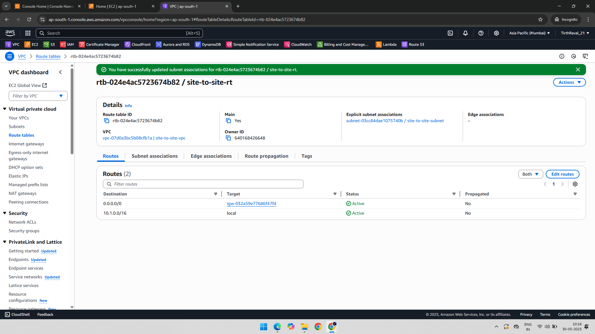

---

### 3️⃣ Virtual Private Gateway Created (AWS Side)

📷 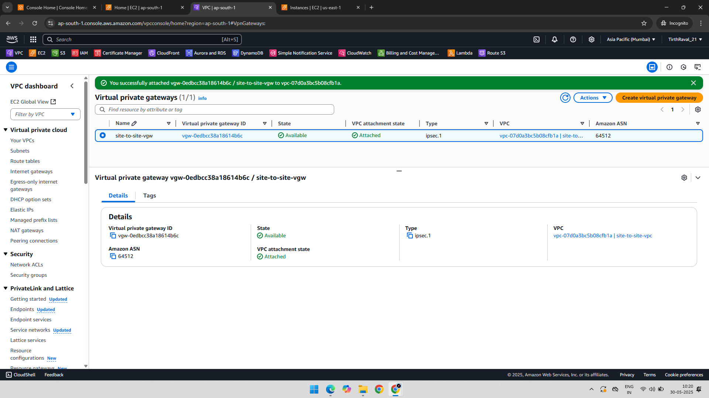

---

### 4️⃣ On-Premises VPC Created

📷 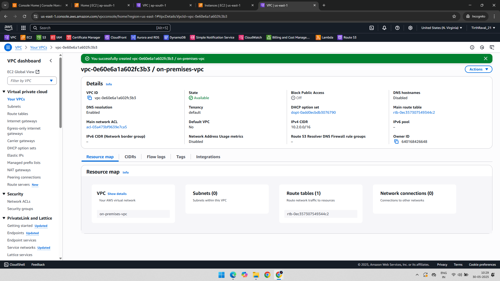

---

### 5️⃣ On-Premises Route Table Configured

📷 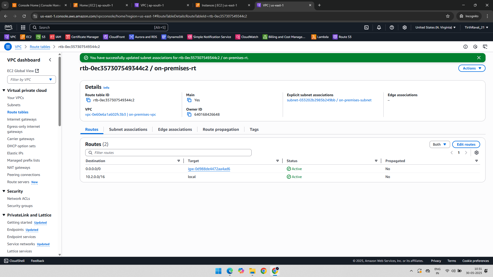

---

### 6️⃣ On-Premises EC2 Instance Launched

📷 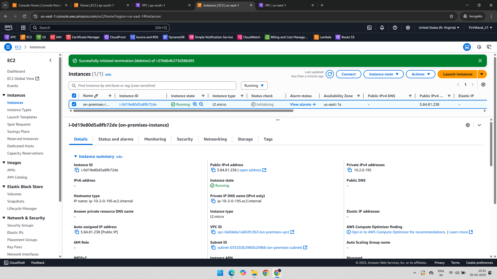

---

### 7️⃣ Customer Gateway Created in AWS

📷 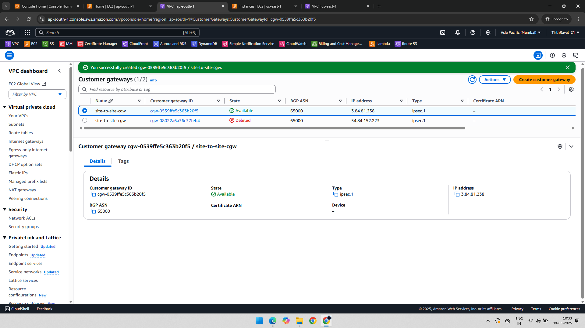

---

### 8️⃣ SSH into On-Premises Instance

📷 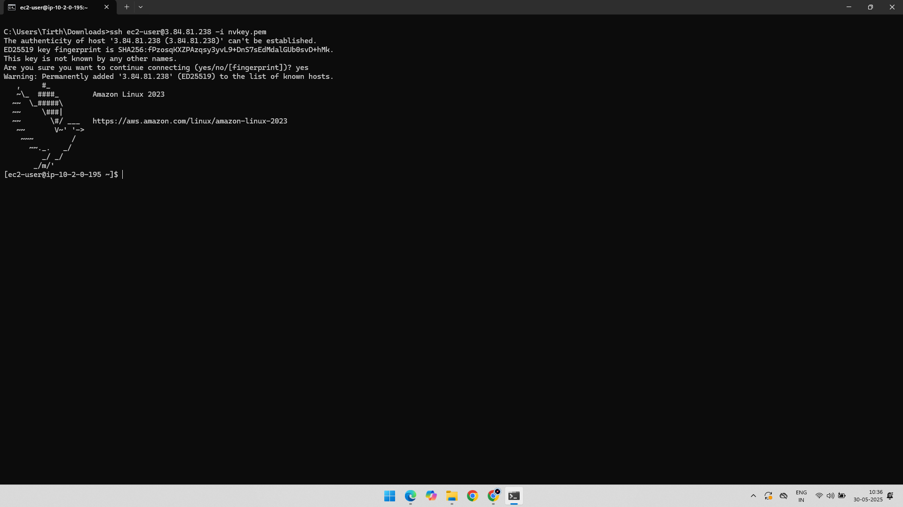

### ✅ Step 2.1: Install Libreswan
#### SSH into the on-premises Linux server:

#### ssh -i /path/to/key.pem ec2-user@3.237.85.89

#### sudo yum install libreswan -y

---

### ✅ Step 2.2: Enable IP Forwarding

#### Edit /etc/sysctl.conf:

#### sudo vim /etc/sysctl.conf

### Add:

#### net.ipv4.ip_forward = 1

#### net.ipv4.conf.all.accept_redirects = 0

#### net.ipv4.conf.all.send_redirects = 0

### Apply changes:

#### sudo sysctl -p

---

### ✅ Step 2.3: Create VPN Configuration Files

### 🔸 myconnection.conf

#### sudo vim /etc/ipsec.d/myconnection.conf

### Add:

#### conn Tunnel1

####  authby=secret

####  auto=start

####  left=%defaultroute
 
#### leftid=3.237.85.89             # Replace as per config
 
#### right=13.126.216.225           # AWS VPN Endpoint IP
 
#### type=tunnel
 
#### ikelifetime=8h

####  keylife=1h
 
#### keyexchange=ike
 
#### leftsubnet=10.2.0.0/16         # On-prem subnet
 
#### rightsubnet=10.1.0.0/16        # AWS subnet

####  dpddelay=10
 
#### dpdtimeout=30
 
#### dpdaction=restart_by_peer

#### 🔸 myconnection.secrets

#### sudo vim /etc/ipsec.d/myconnection.secrets

#### Add:

#### 3.237.85.89 13.126.216.225 : PSK "HNWZYq6o45jXAyfNGlhIDGw5XIaBZOxM"

### ✅ Step 2.4: Start IPsec Service

#### sudo systemctl restart ipsec

#### sudo ipsec status

---

### 9️⃣ VPN Connection Created on AWS Side

📷 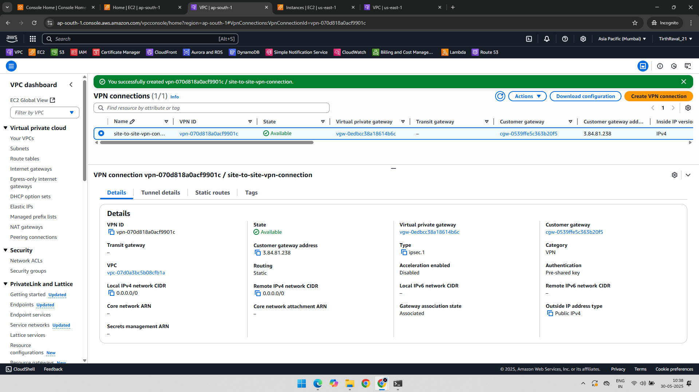

---

### 🔟 VPN Configuration File Downloaded

📷 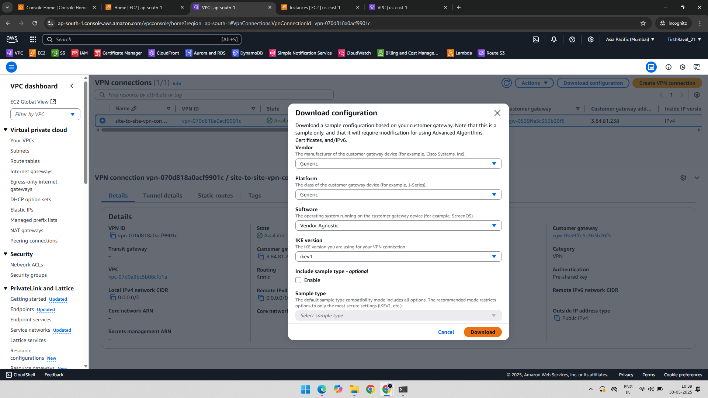

---

### 1️⃣1️⃣ Security Group Edited on On-Premises Instance

📷 

---

### 1️⃣2️⃣ Routes Added to AWS Route Table

📷 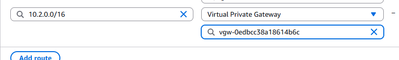

---

### 1️⃣3️⃣ AWS-side EC2 Instance Created

📷 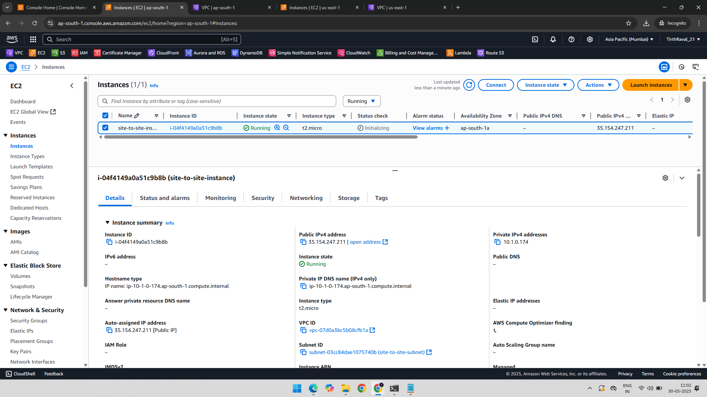

---

### 1️⃣4️⃣ SSH with AWS Instance Public IP and Ping to On-Premises Private IP

📷 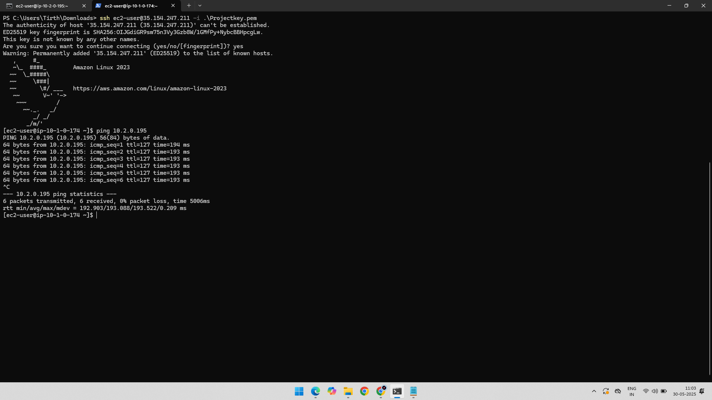

---

### 1️⃣5️⃣ Ping from On-Premises Instance to AWS Private IP

📷 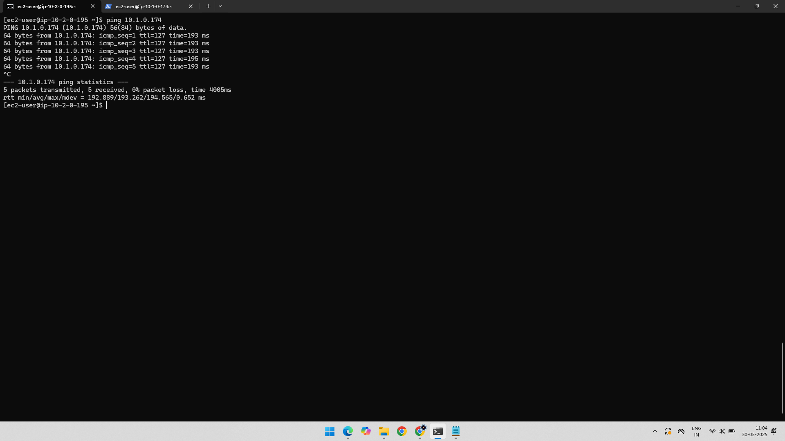

---

### 1️⃣6️⃣ Private Key for AWS Instance

📷 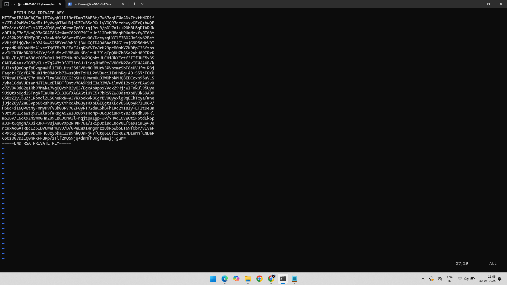

---

### 1️⃣7️⃣ SSH to AWS Instance from On-Premises Using Private IP

📷 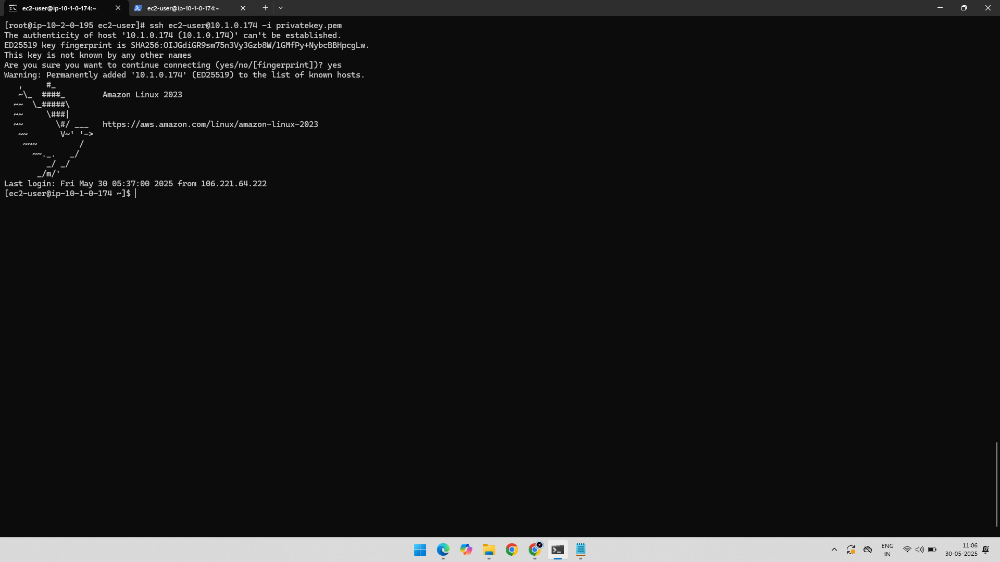

---

### 1️⃣8️⃣ VPN Tunnel 1 Status - Up

📷 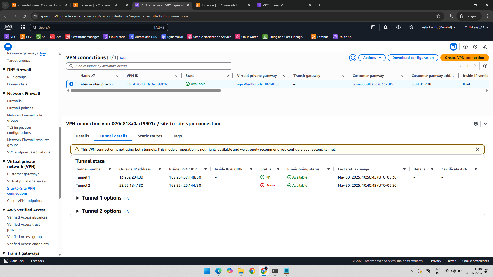

---

## ✅ Final Output

- Site-to-Site VPN connection between AWS and On-Premises successfully established.
- Bi-directional connectivity verified using SSH and ping between AWS and On-Premises EC2 instances.
- Network routing properly configured with updated route tables on both sides.
- VPN tunnel status shows active and stable connection.

---

## 📂 Folder Structure

AWS-VPC-Site-to-Site-VPN-Project/
├── 01-VPC-Created-AWS-Side.png
├── 02-AWS-Side-Route-Table.png
├── 03-Virtual-Private-Gateway-Created.png
├── 04-VPC-Created-On-Premises-Side.png
├── 05-On-Premises-Side-Route-Table.png
├── 06-On-Premises-Instance.png
├── 07-Customer-Gateway-Created.png
├── 08-SSH-On-Premises-Instance.png
├── 09-VPN-Connection-AWS-Side.png
├── 10-Downloaded-Configuration-File.png
├── 11-Edited-Security-Group-On-Premises-Instance.png
├── 12-Added-Routes-AWS-Side-Route-Table.png
├── 13-AWS-Side-Instance-Created.png
├── 14-SSH-AWS-Side-Instance-Ping-PrivateIP-On-Premises-Instance.png
├── 15-On-Premises-Ping-PrivateIP-AWS-Side.png
├── 16-PrivateKey-AWS-Side-Instance.png
├── 17-SSH-PrivateIP-of-AWS-Side-in-On-Premises-Side.png
├── 18-Tunnel-1-up.png
└── README.md

